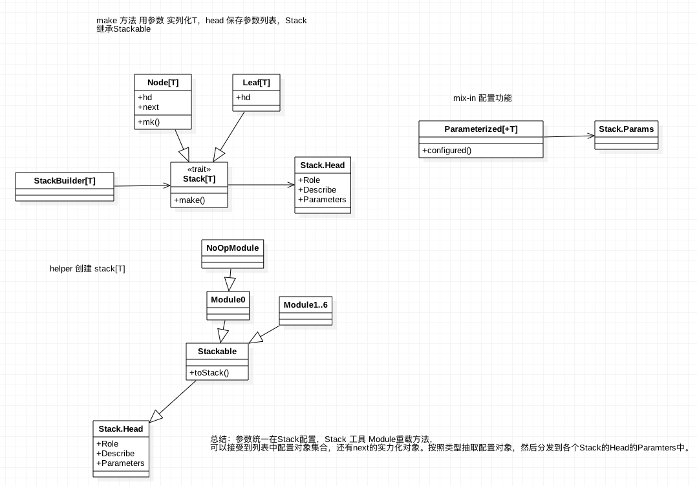
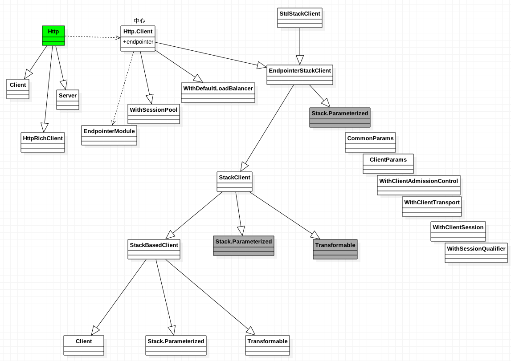

## Finagle 源码分析之 Stack[T]


#### Stack[T]

```
Stacks represent stackable elements of type T. it is assumed that T-typed elements
can be stacked in some meaning ful way; ...
```

1. Stack 提供基础的方法，Stack 调用各种基础方法，把 Stackable 通过 toStack 转换成Stack，并
添加到的Stack的某个位置，同时toStack 接受插入位置的next Stack（这里很关键，比如实现负载均衡，后面会讲到）。
2. Stack 要么是Node，要么是Leaf
3. Stack 如果插入了Leaf（截断），一切操作结束与Leaf，Leaf 内部可以对后面的 Stack进行操作。
4. Module 是 Stackable 的，要么是Leaf，要么是Node。
5. make 把 ，Stack 转为 T， 通过 Node 的 mk  把 Node 转为 Leaf，嵌套调用Leaf，make，再转为T
6. Module 实现了 mk，通过用 Module 的 Make，来materialize。

总之，materialize 如下， Stack[T] 方法 make ，传入params, 如果是 Node 调用 Module进行一次变换，
一般来说，模块递归调用 next 的 make， 然后使用 make 返回的 T ，把自己转换为T返回，如此递归，一直遇到Leaf，所以Leaf首先被materialize，然而toStack中，插入Leaf，那么next，由模块来控制materialize。
如Load balance，通过调用 newClient 创建多个连接（后续再详细分析）。




###### Params[T]

以Param[T] 默认值作为key，如果没有找到，返回默认value


#### Http.Client

Http 实现Http 服务的请求和处理



1. StackClient 抽象 Stack，Parameterized，提供基本的 Stackable 模块配置，配置能力
2. EndponiterStackClient 抽象 Endpoint 接口，同时 通过trait 提供各个 Stackable 的配置方法
3. Http.Client 具体实现，提供 Endpoint 实现。
