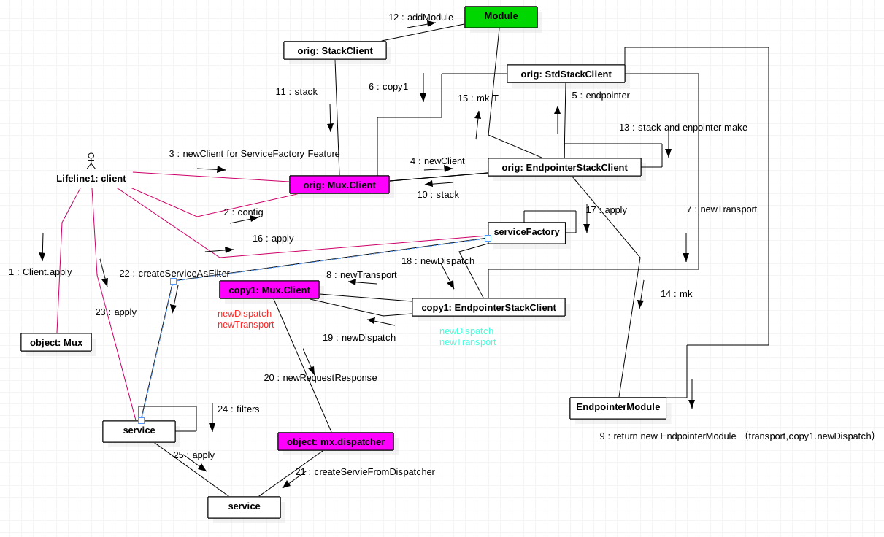

## Finagle 源码分析之 Mux.client


Finagle 客户端实现过程，这里以Mux协议为例，Http实现几乎一样。

```
The core of Finagle is protocol-agnostic, meaning its internals provide an extensible RPC subsystem without defining any details of specific client-server protocols. Thus in order to provide usable APIs for clients and servers, there are a number of Finagle subprojects that implement common protocols.
```





Mux.Client 的 trait 的调用时序如下

* 1 Mux.apply 创建新的客户端 org:Mux.Client
* 2 org:Parameterized , orig.configure 参数配置
* 3 orig:Mux.Client orig.newClient
    * 4 orig:EndpointerStackClient orig.newClient
        * 5 orig:StackClient orig.endpointer
            * 6 orig:StackClient orig.copy1
            * 7 copy1:EndpointerStackClient copy1.newTransport
                *   8 copy1:Mux.Client copy1.newTransport
            * 9 new EndpointerModule( transport, copy1.newDispatch)
        * 10 orig:Mux.Client  copy1.stack
            * 11 StackClient StackClient.stack
                * 12 StackClient return new StackBuilder.addModule
        * 13 (stack ++ endpointer).make

4. StackClient.stack 返回 stack
5. StackClient.stack 返回 stack 前调用 addModule, 加入Module
6.
