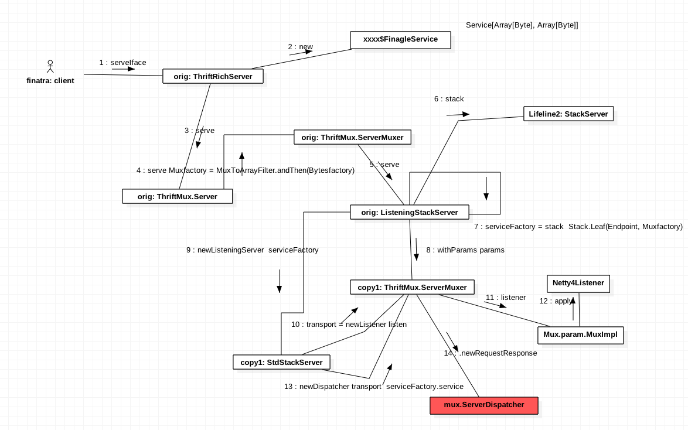

## Finagle 源码分析之 Mux.ThriftMux

- Author: Yuetao Meng
- Mail: mfty1980@sina.com
- Date: 2018-1-2

Finagle 服务端实现过程，由于协议无关性，这里以Mux协议为例，Http等流程相同。

ThrifxMux.server 的 trait 的调用时序如下：

* 1 serviceIface
* 2 使用 thrift 生成的 xxx FinalgeService 进行数据的处理，将Iface转换为Service[Array[Byte],Array[Byte]]
* 3 调用 serve
* 4 Byte 转 Mux
* 5 ServerMuxer serve
* 6 StackServer 加载默认的filter
* 7 materialize serviceFactory
* 8 调用 withParam 创建 copy1
* 9 newListensingServer
* 10 newListener 创建 transport
* 11 listen transport
* 12 Netty
* 13 newDispatch transport serviceFactory.service
* 14 mux.ServerDispatcher

 **最重要的方法**

2 ServerIface转Iface到Service[Array[Byte],Array[Byte]]
4 Byte 转 Mux
10 newDispatch 接收 Mux
