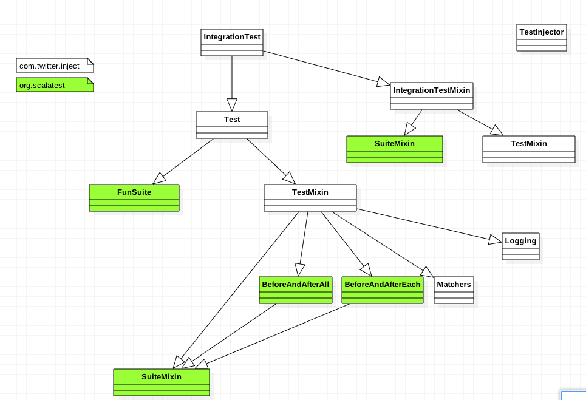

## Finatra 源码分析之 test


- Author: Yuetao Meng
- Mail: mfty1980@sina.com
- Date: 2018-5-10


## Test 概览

finatra Test 相关结构如下：





### FunSuite

1. 测试风格
2. Assertions使用如下：

```
assert for general assertions;
assertResult to differentiate expected from actual values;
assertThrows to ensure a bit of code throws an expected exception.
assume to conditionally cancel a test;
fail to fail a test unconditionally;
cancel to cancel a test unconditionally;
succeed to make a test succeed unconditionally;
intercept to ensure a bit of code throws an expected exception and then make assertions about the exception;
assertDoesNotCompile to ensure a bit of code does not compile;
assertCompiles to ensure a bit of code does compile;
assertTypeError to ensure a bit of code does not compile because of a type (not parse) error;
withClue to add more information about a failure.

```

### SuitMixin

测试生命周期

### IntegrationTestMixin

基本没有什么功能，定义了Inject，实现可以用 TestInject
测试用可以用到Gucie


### Matcher

matchers DSL 参考 scalaTest 文档

[http://www.scalatest.org/user_guide/using_matchers](http://www.scalatest.org/user_guide/using_matchers)
