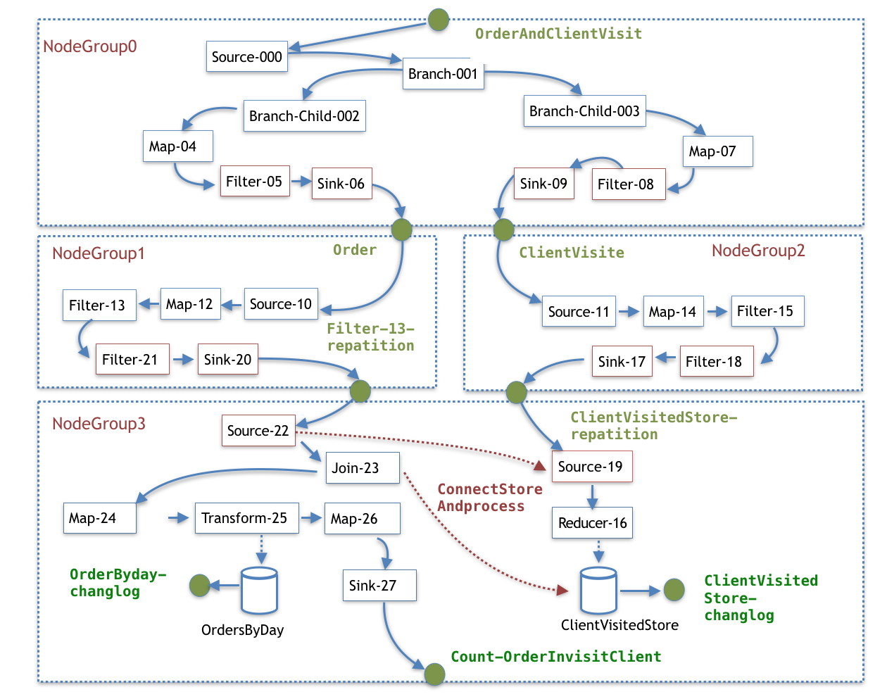

# KafkaStream 分析

- Author: Yuetao Meng
- Mail: mfty1980@sina.com
- Date: 2018-1-25 v0.1

## 说明

读了官网的介绍如下，觉得不是说的很明白，下面补充一下。

[官方的架构文档](https://docs.confluent.io/current/streams/architecture.html)


## 比较难懂的概念

### 关于各种Id

在一个KafkaStream 与 kafka consumer 存在如下关系

- AppId = GroupId  理解为相同的AppId在同一个集群
- ProcessId = 随机数字 UUID，区分KafkaStreamThread的进程是否相同
- ClientId = AppId + ProcessId 同一个集群不同的进程。
- KafkaStreamThreadId = clientId + ‘StreamThread’ + 自增（AutoIncream）
   同一个集群不同的进程下的线程。
- client.id=KafkaStreamThreadId + 'consumer' KafkaStreamThreadId
  线程向kafka发起连接用，用于kafka调试

### NodeGroup，TopicGroup，Co-partion，re-partion

文档和源码里提到的一些词的理解：

- NodeGroup 在一个子拓扑图的 NodeProcesser，源于Stream，结束与Sink，join等操作引起
ConnectStoreAndprocesser、ConnetProcesser 会连接两个Stream，re-partition会引起子拓扑图。详见 ```makeNodeGroups``` 方法
- TopicGroup 同一个 NodeGroup 的 Topic , 详见 ```topicGroups``` 方法
- Co-paration ， NodeGroup 多个Topic， Topic 必须有相同的分区。
- re-partion 满足拓扑计算，自动生成的InternalTopic

### 并发模型

下面的文字说明了，kafka如何执行集群中的Topic分配

> Members of the consumer group subscribe to the topics they are interested in and forward their subscriptions to a Kafka broker serving
> as the group coordinator. The coordinator selects one member to perform the group assignment and
> propagates the subscriptions of all members to it. Then {@link #assign(Cluster, Map)} is called
> to perform the assignment and the results are forwarded back to each respective members

kafkaStream 实现了 ```StreamPartitionAssignor``` ，```DefaultPartitionGrouper```来确定分区在集群中的分配和再分配
具体实现可以参考 ```StreamPartitionAssignor.assign```，```DefaultPartitionGrouper.partitionGroups```

kafka最小并发单位是task，同一个app中，task只能在一个线程中，算法简单说明如下：

- 一个Task 分配一个 NodeGroup 即子拓扑，的一个partition，所以总的数量
TaskNum =  NodeGroup0 * NodeGroup0PartionNum + NodeGroup1 * NodeGroup1PartionNum + NodeGroup2 * NodeGroup2PartionNum ...
- Task 中处理的代码无需考虑并发问题。
- StreamPartitionAssignor 使用RoundRabin 算法分配Task到集群中的 Thread ，注意是在集群中包括不同process的Thread
- 例如： Task0（Group0，Group0.topic1.patition0，Group0.topic2.patition0）,
Task1（Group0，Group0.topic1.patition1，Group0.topic2.patition1）,Task2（Group1，Group1.topic3.patition0）,
Task3（Group1，Group1.topic3.patition1）

### co-partion 分区计算方法

详见  ```StreamPartitionAssignor.assign```  可以搜索一下 ```ensureCopartitioning``` 函数自己看一下

简单如下，只是大概意思：

1. 与souceTopic相同
2. 多个souceTopic，如果计算，与Co-partition相同
2. 多个souceTopic，使用最大的分区


### 内部Topic的创建

具体算法，可以搜索prepareTopic 这个函数，自己看一下相关的上下文代码

## 通过一个例子说明

假设 kafka Topic （OrderAndClientVisit）上存在 Json 格式的 **订单**（order[orderId,date,clientId]）
 和 **客户拜访**（ClientVisit[cientId,date]）, 需要计算每天拜访客户的订单，输出到
 Topic Count-OrderInvisitClient， 格式为 Avro 计算过程如下：


 

```
      step1 KStream branchies= builder.stream( "OrderAndClientVisit").branch(fn1);
      step2 branches[0].map(fn2).filter(fn3).to("Order");
      step3 branches[1].map(fn4).filter(fn5).to("ClientVisit");

      step4 KStream s001=builder.stream("Order").map(fn6).filter(fn7)
      step5 KStream s002=builder.stream("ClientVisit").map(fn8).filter(fn9)

      step6 KTable  t001 = s002.groupByKey().reduce(fn10,ClientVisitedStore);
      step7 KStream s003 = s001.join(t001, fn11);

      step8 s003.map(fn12).transform(fn13, OrdersByDay).map(fn14).to(Count-OrderInvisitClient)
```

- Step1 读取数据 Stream（OrderAndClientVisit），拆分数据branch（fn1），
把从一个Stream数据拆分到两个KStream，branches[0]，branches[1]
- Step2 map（fn2）变换Order格式到avro格式 key=orderId，value=order，filter（fn3）过滤异常数据，to（"Order"），保存到 **order** Topic
- Step3 同Step2，把Visit数据格式化avro，并过滤异常数据，key=Visit，value=Visit 保存到 **ClientVisit** Topic
- Step4 读取Topic **Order**，并map(fn6)转换格式到 key=data+clientId，value=orderId，filter(fn7)过滤异常数据
- Step5 同Step2，读取Topic **ClientVisit**，并map(fn8)转换格式到 key=data+clientId，value=""
- Step6 reduce(fn10,ClientVisitedStore) 使用状态Store过滤重复数据，避免ClientVisit有时kafka消息绘重发导致结果错。
- Setp7 join数据，过滤订单，输出内部数据 key=data+clientId，value=orderId
- Setp8 s003.map(fn12)，如有需要输出格式调整key=data+clientId+orderId，transform(fn13, OrdersByDay）自定义状态处理fn13
  使用状态Store过滤重复数据，避免重复的订单消息，map(fn14).to(Count-OrderInvisitClient)，fn14转换消息格式为Avro
  Count-OrderInvisitClient 输出格式，key=data+clientId+orderId ， value = rank（count）
