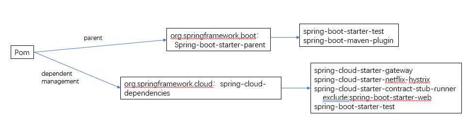

# 搭建一个spring gateway的应用

- Author: Yuetao Meng
- Mail: mfty1980@sina.com
- Date: 2020-9-14

## 概述

通过动手实践spring官方[Building a Gateway](https://spring.io/guides/gs/gateway/) 应用程序，目的如下：
- 快速了解需要依赖的框架和库，包括测试
- 为后续开发搭建基础

## 依赖

通过对pom文件的分析,最小的依赖如下：

如图 spring boot和cloud 相关应用仅需依赖 boot 和 cloud 就可以干大部分的事情了非常简单，测试的话，依赖boot-start-test就可以了

## 可用模式一

- `@RunWith(SpringRunner.class)` 快速启动单元测试
- `@SpringBootTest` 快速启动集成测试
- `@AutoConfigureWireMock` 快速创建集成http测试stub
- `@ConfigurationProperties` , `@EnableConfigurationProperties` 支持快速配置和测试，都用这种模式方便
- `@SpringBootApplication` 和 `Application` 快速启动一个程序

## 疑问
- `RouteLocator` 是否可以和配置合用呢
- `Httphandler` 和 gateway的关系
- 这个玩样看着简单，但是不知道怎么用

## 遗留
- `flatten-maven-plugin`

## 架构分析
一个gateway包含很多route，每个route 通过 Predicate进入 route，route里面有很多filter
route可以由 properties 组装
